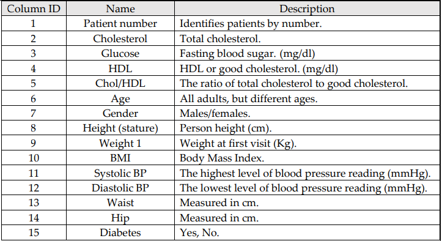

# Type-II Diabetes Prediction

## Objective
Early detection of type 2 diabetes based on the provided data and comparing with the suggested approach as mentioned as part of the Cousework.

## Data 

500 records (each representing an individual person) and 15 features as follows :

## Steps

1. Basic data cleaning & preprocessing
2. Feature Engineering
   - Creating new features from existing based on the reference articles (considered as domain knowledge) 
   - Selecting features based on PCA, RFE, Chi-squared tests
3. Modelling
   - Using different Classifiers like Random Forest, Decision Tree, Gradient Boost 
   - Voting Classifier (ensemble of above mentioned models)
4. As required by the coursework, devicing solution in 2 approaches and comparing the selected final models
   - Approach 1 : Model with Preprocessing, feature engineering with help of the reference article knowledge
   - Approach 2 : A generic approach to build a solution without referring to articles

## Conclusion
In conclusion, this project addresses the problem statement outlined above by providing the following solution :

- The Final model is a Voting Classifier with ensemble of Random Forest, Gradient Boost and Decision Tree yielding 96 Accuracy and 94 Recall rate.
- In context of the data and the process followed, Approach 2 (final model) yeilded better result compared to Approach 1.
- Using Approach 1, the model acheived 87 Accuracy and 81 Recall rate.