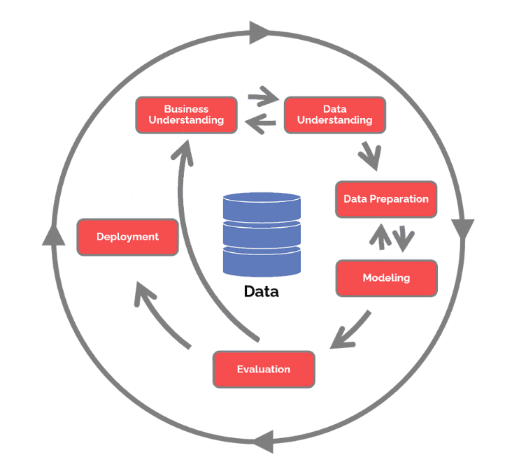

# Type-II Diabetes Prediction

## Introduction
Identifying B-cell epitopes is crucial in developing vaccines and diagnostic tests against infectious diseases, allergies, and some cancers. However, the experimental discovery of epitopes can be time-consuming and resource-intensive. This coursework involves developing an efficient data mining pipeline to predict B-cell epitopes for Alphavirus, a genus of mosquito-borne viruses [1-3]. We will make use of the different levels of datasets segregated by the density of the Alphavirus and its distant relatives. We are following a typical Data mining workflow like CRISP-DM with different stages of development, including EDA, Pre-processing, Feature Engineering and Modelling. After testing different classification models, we achieved good results (0.91 ROC-AUC Score) for the LogisticRegression models. The model was almost robust to the class imbalance in the Level-2 dataset, especially with the class of interest being the minority class. However, the model performing well with the Level-2 dataset suggests that the models are not entirely robust towards higher-level datasets with a more distant relative of the virus.

## Data 

The data used in this coursework is the epitope dataset to predict Alphavirus, retrieved and consolidated from online databases IEDB, Genbank and UniProtKB by Dr Felipe Campelo and Ms Abi Sowriraghavan as part of the CS4850 Data Mining module. The datasets were available on the blackboard as .csv, .pkl and .rds files for Python and R, respectively.

The research [1-3] shows a potential trade-off between a smaller volume with data similar to the target and a larger dataset with different viruses. Therefore, five datasets with increasing volumes with more data from distant relatives of the Alphavirus genus are used to explore this.

### Data Structure :

All the datasets have 1293 attributes and one target class. The general structure of the data is as follows.
-	Information Columns: Of the 1293 attributes, 13 columns with the prefix 'Info_' represents general information about the observations and are usually not useful for predictions.
-	Feature Columns: There are 1280 attributes labelled with the prefix 'feat_' extracted using a state-of-the-art feature embedder for protein data, ESM-1b [4].
-	Target/Class Columns: 1 Class column labelled 'Class'.

Even though the information columns are not helpful for modelling or prediction, one of the Information columns, “Info_cluster”, seems to categorize the observations. So this information is used to split the data so that the clusters are spread-out evenly across train, test and validation sets.

## Process

The development tried to follow the standard CRISP-DM methodology as much as possible, focusing on below steps
1. Exploratory Data Analysis
2. Preprocessing & Feature Selection
3. Model Building (Pipeline)
4. Evaluation

## Conclusion

Out of the differnt models and appraoches, only two models have achieved high-performance scores. In order to deal with class imbalance, over-sampling with SMOTE and balancing class weights in the learning algorithm worked better than undersampling. The selected best model obtained has a 0.91 AUC ROC score built from the Level-2 dataset. However, even when the same process is followed to build the model from the level-3 dataset, the max performance achieved is 0.67. This could be because of the extra data added from the distant relatives of the Alphavirus.